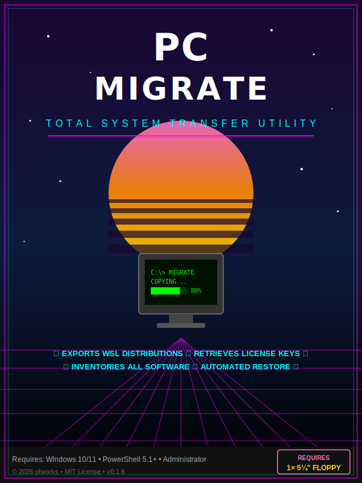

# Windows Migration Tool

<p align="center">
  
</p>

A Windows application (with GUI) to export and restore your environment when moving to a new Windows 10/11 machine.

## What It Does

- **Exports WSL distributions** as `.tar` archives (plus `.wslconfig`)
- **Inventories all installed software** (Win32 + Store apps) with versions and download URLs
- **Retrieves license keys** — Windows product key, Office activation, registry-stored serials
- **Exports winget packages** for automated bulk reinstall on the new machine
- **Generates a restore script** that runs on the destination machine

## Requirements

- Windows 10 (version 1709+) or Windows 11 on the source machine
- Windows 11 on the destination machine
- PowerShell 5.1+
- **Run as Administrator**
- External drive or network share with enough space for WSL exports
- winget (pre-installed on Windows 11; on Windows 10, install from the [Microsoft Store](https://apps.microsoft.com/detail/9NBLGGH4NNS1) or [GitHub](https://github.com/microsoft/winget-cli/releases))

## Installation

### Option A: Download from GitHub Releases
1. Go to the [Releases](../../releases) page
2. Download `PCmigrate_Setup.exe` (installer) or `PCmigrate_Portable.zip` (no install)
3. For the installer: run it — it creates a Start Menu shortcut and optional desktop icon
4. For portable: extract the zip and run `PCmigrate.cmd`

> **Note:** Windows SmartScreen may block the unsigned installer. Click **"More info"** → **"Run anyway"** to proceed.

### Option B: Build the Installer Yourself
1. Download and install [Inno Setup 6](https://jrsoftware.org/isinfo.php)
2. Compile `installer.iss` to produce `PCmigrate_Setup.exe`

### Option C: Portable (no install, from source)
Double-click `PCmigrate.cmd` or run `PCmigrate-GUI.ps1` directly.

For the retro DOS-style interface, run `PCmigrate-Retro.ps1` instead.

## Usage

### GUI Mode
Launch the app from the Start Menu, desktop shortcut, or `PCmigrate.cmd`. Use the Browse button to select your external drive, then:
- Click **Export** to back up this machine
- Click the **▼** arrow next to Export for options: "Export Only", "Export + Create Restore Bundle", or "WSL Only"
- Click **Restore** on the new machine (point it at the export folder)
- Click **Cancel** at any time to stop a running operation

### Command Line

#### On the old machine

```powershell
# Export to an external drive
.\Migrate-Machine.ps1 -OutputPath "E:\PCmigrate"

# Export and create a self-contained restore zip
.\Migrate-Machine.ps1 -OutputPath "E:\PCmigrate" -Bundle

# WSL only (skip software inventory and license keys)
.\Migrate-Machine.ps1 -OutputPath "E:\PCmigrate" -WslOnly

# Or default to Desktop\PCmigrate
.\Migrate-Machine.ps1
```

#### On the new machine

Move the drive over, then:

```powershell
E:\PCmigrate\Restore-Machine.ps1
```

Or specify the path manually:

```powershell
.\Restore-Machine.ps1 -ImportPath "E:\PCmigrate"
```

## Output Structure

```
PCmigrate/
├── license_keys.txt          # Windows/Office/software keys
├── installed_software.csv    # Full inventory (machine-readable)
├── installed_software.txt    # Full inventory (human-readable)
├── installed_software.html   # Interactive checklist with download links & keys
├── winget_packages.json      # For 'winget import'
├── WSL/
│   ├── Ubuntu.tar            # (example) WSL distro archive
│   └── .wslconfig            # WSL global config
├── Restore-Machine.ps1       # Run this on the new machine
└── migration_log_*.txt       # Export log
```

## Post-Restore Steps

1. Set your default WSL user: `<distro> config --default-user <username>`
2. Manually install apps not available via winget (check the CSV)
3. Re-enter license keys from `license_keys.txt`
4. Restore any app-specific settings/configs not covered by this tool

## Limitations

- License keys are only retrievable if stored in BIOS/UEFI or the registry. Digital licenses tied to a Microsoft account transfer automatically.
- Some winget packages may fail to import if the source or package ID has changed.
- WSL exports include the full filesystem — large distros will produce large tar files.
